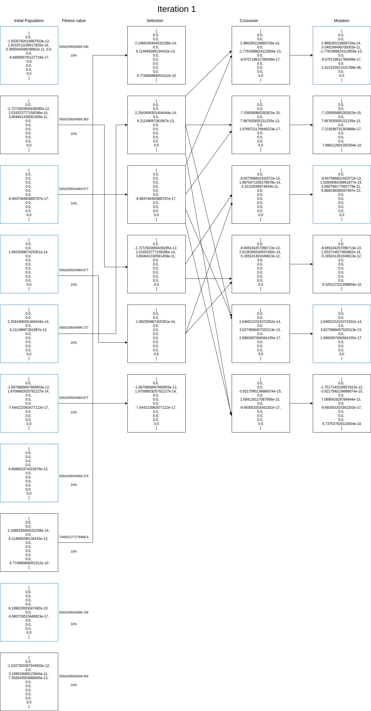
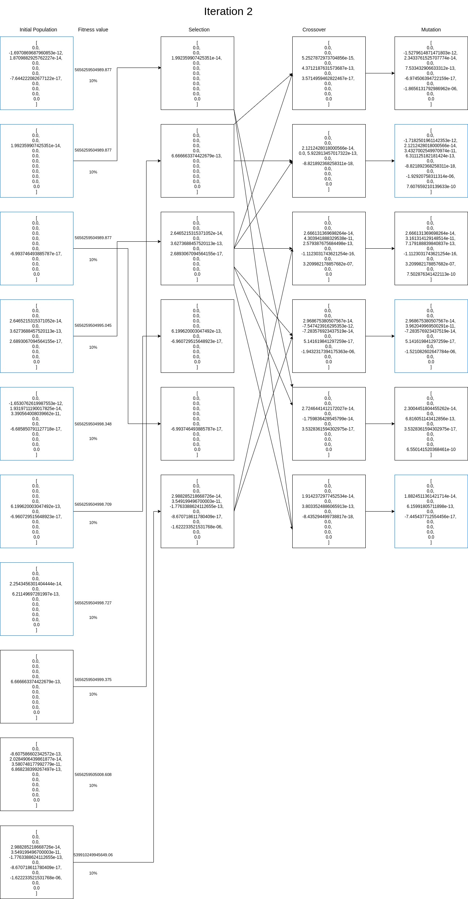
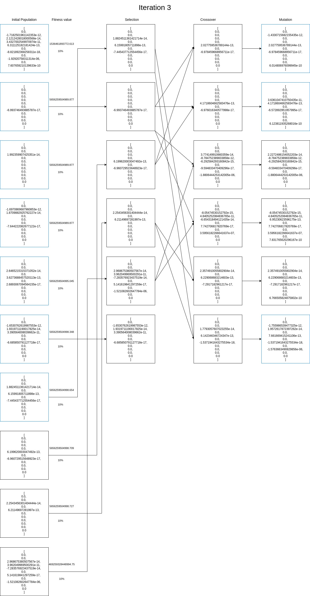

# MDL Genetic Algorithms

Team: Megha Bose, Nirmal Manoj C.

## **Genetic Algorithms**

Given coefficients of features corresponding to an overfit model, we need to apply genetic algorithm in order to get suitable vectors by reducing the overfitting.

## **Summary**

**Genetic algorithm** is a search heuristic that is inspired by Charles Darwin’s theory of natural evolution.

Implemention:

- Initialize a population
- Determine fitness of population
- Until convergence repeat the following:
    - **Select parents** from the population
    - **Crossover** to generate children vectors
    - Perform **mutation** on the children vectors
    - Calculate **fitness** for new population
    - **Pass** some **best vectors** from parent population and some best vectors from children population to the next generation

Each population contains multiple individuals where each individual represents a point in search space and possible solution.

Each stage consists of:

### **Selection**

We try to give preference to the individuals with good fitness scores and let them pass their genes to the successive iterations.

### **Crossover**

Two individuals are selected using selection and their genes are combined in a way to generate child vectors.

### **Mutation**

Inserting random genes in offspring to maintain the diversity in the population and to avoid premature convergence.

## **Algorithm + Code Explanation**

The code is **vectorized** and **modular.**

### Variables:

POPULATION_SIZE: The size of the population taken is varied between 10 and 20. 

MATING_POOL_SIZE: From the population, the mating pool is selected with a size varying from 7 to 15 depending upon the population size. 

GENE_LENGTH: Every individual is a vector of size 11 with floating-point values in the range of [-10, 10].

MUTATION_PROB: For each vector, the mutation is performed at each index with a probability varying from 0.3 to 0.5.

TRAIN_WT: The weight of training error while calculating the fitness function.

NO_CHLD_SELECTED: Number of best children surely passed onto the next generation from the generated vectors. 

NO_INIT_SELECTED: Number of best vectors from the mating pool surely passed onto the next generation.

```python
from genetic import FitnessFunc, mutation, population_fitness, run_evolution
from client import *
# from random import choices, randint, randrange, random
import random
import numpy as np
import json
import os
# API_ENDPOINT = 'http://10.4.21.156'
# MAX_DEG = 11
# SECRET_KEY='jg3q0CzLVQl9Jsf4PmLIUjuxMK4yU7Vh4b6FzthUbocuLqpvGG'

POPULATION_SIZE = 20
MATING_POOL_SIZE = 12
GENE_LENGTH = 11
MUTATION_PROB = 0.3
TRAIN_WT = 1
NO_CHLD_SELECTED = 8
NO_INIT_SELECTED = 4

population = []
child_population = []
mating_pool = []
# [(genome, [fitness, error1, error2])]

ch11 = []
ch22 = []
child_cnt = 0
```

Function to generate all zeroes vector for initialization: 

```python
def generate_genome():
    return [0.0 for _ in range(GENE_LENGTH)]
```

### Initial Population:

Function to generate initial population.

```python
def generate_population():
    global population
    population = []
    tmp =  [generate_genome() for _ in range(POPULATION_SIZE)]
    for i in range(0, len(tmp)):
        tmp[i] = mutation(tmp[i])
        population.append((tmp[i], find_fitness(tmp[i])))
```

### **Fitness Function:**

In the fitness function, we first get the train and validation error for the genome using get_errors requests.

The fitness value is calculated as the absolute value of (Training error * TRAIN_WT + validation error). 

**TRAIN_WT = 1**

This calculates the sum of training and validation errors. This is used to ensure that both the errors are minimised while minimising the fitness value.

**TRAIN_WT = -1**

After the training and validation errors reduced considerably, the difference between them still remained large. Hence this was used to bring the values closer.

```python
def find_fitness(genome):
    error = get_errors(SECRET_KEY, list(genome))
    fitness = abs(error[0] * TRAIN_WT + error[1])

    return [fitness, error[0], error[1]]
```

### Selection:

The mating pool is generated by selecting MATING_POOL_SIZE number of vectors after shuffling the population. This helps in bringing randomness to the selected vectors.

```python
def compare(xx):
    return xx[1][0]

def generate_mating_pool():
    global population
    global mating_pool
    # population = sorted(population, key=compare)
    random.shuffle(population)
    mating_pool = population[:MATING_POOL_SIZE]
    np.random.shuffle(mating_pool)

```

### **Crossover Functions:**

**Single point crossover**

We were using single-point crossover initially. In this type of crossover, the first parent is copied into a child till a certain index, and the rest are copied from the second parent and vice-versa for the other child. However, this results in little variation from the parents as the genes are directly copied.

```python
def single_point_crossover(parent1, parent2):
    global ch11
    global ch22
    split_point = random.randint(1, GENE_LENGTH - 1)
    ch11 = parent1[0:split_point] + parent2[split_point:]
    ch22 = parent2[0:split_point] + parent1[split_point:]
```

**Blend Crossover**

In blend crossover, for two parent genes $p1$ and $p2$, a gene is selected randomly from the range

 $[p1 - \alpha(p2 - p1), p2 + \alpha(p2 - p1)]$

Therefore, the child genes $ch1$ and $ch2$ is taken as follows:

$ch1 = (1-\gamma)p1+\gamma p2$

$ch2 = \gamma p2+(1-\gamma)p2$

where $\gamma = (1+2\alpha)u-\alpha$ and $u$ is a random value between 0 and 1. It is seen that $\alpha=0.5$ performs better than other values. We can see that the location of children depends on the difference between the parent values. The more the difference between parents, the more is the difference between children and parents too. Thus spread of parents dictates the spread of their children. This kind of self-adaptation may help in searching for better search spaces by either converging or diverging according to the current population.

```python
def cross_over(parent1, parent2):
    global ch11
    global ch22
    alpha = 0.5
    ch11 = []
    ch22 = []
    for i in range(GENE_LENGTH):
        gamma = (1. + 2. * alpha) * random.random() - alpha
        ch11.append((1. - gamma) * parent1[i] + gamma * parent2[i])
        ch22.append(gamma * parent1[i] + (1. - gamma) * parent2[i])
```

### Mutation:

The function below is used to get mutated value at an index of a genome. The value at the index is replaced by a random value from a uniform distribution around the current value or a particular vector value at that index (like given overfit vector or a good vector found).

```python
def get_mutated_value(genome, index):
    return genome[index] * random.uniform(0.85, 1.15)
```

Mutation is done with a probability of MUTATION_PROB.

```python
def mutation(genome):
    for _ in range(GENE_LENGTH):
        index = random.randrange(len(genome))
        genome[index] = genome[index] if random.random() > MUTATION_PROB 
				else get_mutated_value(genome, index)
    return genome
```

### Mating Function:

In the reproduce() function, we select two parent genomes randomly from the mating pool, do crossover and then mutate the children. Then the fitness values of the mutated children are calculated and saved along with the corresponding genome in the child population.

```python
def reproduce():
    global ch11
    global ch22
    global mating_pool
    global child_cnt
    p1 = random.randint(0, MATING_POOL_SIZE-1)
    p2 = random.randint(0, MATING_POOL_SIZE-1)

    print("REPRODUCTION")
    print("Parent 1")
    print(mating_pool[p1])
    print("Parent 2")
    print(mating_pool[p2])

    # single_point_crossover(mating_pool[p1][0], mating_pool[p2][0])
    cross_over(mating_pool[p1][0], mating_pool[p2][0])
    ch1 = ch11
    ch2 = ch22

    print("CHILD: " + str(child_cnt))
    print(ch1)
    ch1 = mutation(ch1)
    fitness_ch1 = find_fitness(ch1)
    print("MUTATED CHILD: " + str(child_cnt))
    print((ch1, fitness_ch1))
    child_cnt = child_cnt + 1

    print("CHILD: " + str(child_cnt))
    print(ch2)
    ch2 = mutation(ch2)
    fitness_ch2 = find_fitness(ch2)
    print("MUTATED CHILD: " + str(child_cnt))
    print((ch2, fitness_ch2))
    child_cnt = child_cnt + 1

    #save mutated children
    
    child_population.append((ch1, fitness_ch1))
    child_population.append((ch2, fitness_ch2))
```

### Eliminating unfit vectors:

The parent and child populations got after an iteration are sorted according to fitness values. Then the top NO_CHLD_SELECTED children and top NO_INIT_SELECTED parents are added to the new generation for the next iteration. The rest of the population is stored and sorted according to fitness. Then the top vectors are used to fill the remaining space in the new generation's population.

```python
def eliminate(GEN):
    global population
    global child_population
    child_population = sorted(child_population, key=compare)
    population = sorted(population, key=compare)

    new_generation = []
    rest_generation = []
    for i in range(NO_CHLD_SELECTED):
        new_generation.append(child_population[i])
    for i in range(NO_CHLD_SELECTED, len(child_population)):
        rest_generation.append(child_population[i])

    for i in range(NO_INIT_SELECTED):
        new_generation.append(population[i])
    for i in range(NO_INIT_SELECTED, len(population)):
        rest_generation.append(population[i])
    
    rest_generation = sorted(rest_generation, key=compare)
    for i in range(POPULATION_SIZE - NO_CHLD_SELECTED - NO_INIT_SELECTED):
        new_generation.append(rest_generation[i])

    population = new_generation
    population = sorted(population, key=compare)
    new_generation = sorted(new_generation, key=compare)
    print("BEST VECTOR###@" + str(GEN))
    print(new_generation[0])
    # print(type(new_generation[0]))
    with open("best_vector_13.json") as json_file:
        data = json.load(json_file)
        # print(data)
        temp = data["best_vector"]
        rowDict = {
            "Generation": str(GEN),
            "Best Vector": new_generation[0],
            "Population": population
        }
        temp.append(rowDict)
        write_json(data)
```

### Run Evolution:

The function below is used to run evolution process using iterations of selection, crossover and mutation to generate new population for successive generation. It executes iterations from gen_from to gen_to.

```python
def run_evolution(gen_from = 1, gen_to = 1):
    global population
    global child_population
    global mating_pool
    if gen_from > gen_to:
        return
    # population = []
		# recalculate_fitness()
	  generate_population()
    # population = []

    for i in range(gen_from, gen_to+1):
        child_cnt = 1
        print("GENERATION #" + str(i))
        print("INITAL POPULATION")
        print(population)
        #save_pop
        child_population = []
        generate_mating_pool()
        #save_pool
        print("MATING POOL")
        print(mating_pool)
        for j in range(int(MATING_POOL_SIZE/2)):
            reproduce()
        
        eliminate(i)
        #save_final_pop
        print("FINAL POPULATION")
        print(population)
        print("END OF GENERATION #" + str(i))
        print("###")
        print("###")
        print("###")
        print("")
```

### Other Functions:

The function below used to write the best vector and population after each generation onto a JSON file.

```python
def write_json(data, filename = "best_vector_1.json"): 
    with open(filename,'w') as f: 
        json.dump(data, f, indent = 4)
```

The function below comes in handy when fitness function is altered and we need the fitness values according to the new function for vectors whose fitness was calculated using old fitness function.

```python
def recalculate_fitness():
    global population

    for i in range(POPULATION_SIZE):
        genome = population[i]
        population[i] = (genome[0], find_fitness(genome[0]))
```

The `try_best_vector()` is used to submit a vector for evaluation.

```python
def try_best_vector():
    print(submit(SECRET_KEY,best_vect))
    quit()
```

The `main()` function calls the function to run the evolution of genomes.

```python
if __name__ == "__main__":
    # try_best_vector()
    run_evolution(1, 20)
```

## **Iteration Diagrams**

POPULATION_SIZE = 10
MATING_POOL_SIZE = 6
GENE_LENGTH = 11
MUTATION_PROB = 0.4
TRAIN_WT = 1
NO_CHLD_SELECTED = 3
NO_INIT_SELECTED = 2

**Blue Boxes denote genomes passed on to next iteration.*

### **First Iteration**



### **Second Iteration**



### **Third Iteration**



## **Hyperparameters**

### **Population size:**

The population size is set between 15 to 25. This seemed to be a good bracket since we had a limited number of daily requests and a considerable number of generations to train in order to reach good valued vectors.  

### **Mating pool size:**

The size of the mating pool is varied from 7 to 20 depending on the population size. This mating pool consists of vectors selected from the population after random shuffling. This helps in maintaining the diversity and randomness in the pool. 

Also, as the population of successive generations is created only using the best vectors from the previous parent and child populations, it ensures that the mating pool consists of good vectors even after the random shuffling.

### **New generation composition**

For the new generation, we choose best `NO_CHLD_SELECTED` vectors from the child and best `NO_INIT_SELECTED` vectors from the mating pool. For the rest of the vectors in the population, we choose best vectors among the rest of the vectors. Here, best refers to vectors with better fitness value.

### **Mutation Probability and Range**

We tried mutation probability from 0.3 to 0.7. But in most of the generations, mutation probability was from 0.3 to 0.4. From the experience that we got from generating multiple vectors, we arrived at a conclusion that 0.3 to 0.4 gives the best new generations.

The range of mutation from the base vector (usually a good vector we got in earlier generations) or the current genome was set to be between 0.6 to 0.95. When starting the generation, we tried with highly variable mutations. Then we gradually reduced it. Towards the end of the project, it stood between 0.85 and 0.95 in most of our generations.

## **Number of iterations to converge**

Number of iterations that it took our models to converge to a value, but still not overfit the test vector was around 50. When we tried by generating a significantly higher no. of generations than 50, we found vectors that give remarkably small errors for the train and validation sets. But the it performed poorly on the test sets. Thus we found that with too many generations, we overfit both train and validations sets. 

## **Heuristics**

- **Initial population**

    The initial population was randomly generated in most cases. Once we tried starting the generation from a set of good vectors that we got from previous generations. But it didn't give us very good vectors.

- **Probabilistic mutation**

    When we are starting generation from a completely random generation, our mutation varied with a higher degree 0.65 to 1.35 times the base vector. The base vector for mutation was at first taken as the overfit vector. But after we got some good vectors, we started taking those vector as the base vector for mutations. We decided to do so because mutations from good vectors tend to give us new good vectors. After around a dozen generations, the population we have become mature enough to mutate from it's own genome. Then we mutate the genome of the child we get and change it randomly between a particular range. The change from the initially value was in the range 0.85 and 1.15 when we wanted to get vectors that are comparatively different from the initial genome. If we feel that the vector is converging, we use smaller variation of the range 0.95 to 1.05 to get better vectors that are closer to the initial one.

- **Varying crossover and mutation**

    At first, we tried single point crossover. In this type of crossover, the first parent is copied into a child till a certain index, and the rest are copied from the second parent and vice-versa for the other child. However, this results in little variation from the parents as the genes are directly copied.

    Then we tried blend crossover. In it,, we can see that the location of children depends on the difference between the parent values. The more the difference between parents, the more is the difference between children and parents too. Thus spread of parents dictates the spread of their children. This kind of self-adaptation may help in searching for better search spaces by either converging or diverging according to the current population.

- **Varying in the fitness function**

    We tried varying the fitness function in multiple ways. At first, we gave a lower than 1 value to the `TRAIN_WT`. It was around 0.7 at first. When this was happening, our mutation was based on the overfit vector for the train. So the essence of this heuristic was the idea that we need to give a lower weightage for the training errors because our mutations were basically variations from the overfit vector.  After generating as such multiple times, we tried setting it at 1. What we found was that these generations give us better vectors. Especially after some dozens of generations. So we found out that the idea that we should give lower weightage to the train error was somehow not as effective as we thought it would be. In most of the generations towards the end of the project, the `TRAIN_WT`  was set at 1.

    When we got good fitness but the difference between train and validation errors were large, we tried setting `TRAIN_WT` to be -1 and then take the absolute value. Idea here is that when lower variation gives better fitness, the model would find vectors that have comparable errors in both train and validation sets. This worked to some extent. But we also found it giving vectors with very high errors but less difference between errors. So we had to selectively pick some low error vectors with small difference between errors for train and validation.

## **Potential vectors**

The best 10 vectors that we submitted are the following

```json
[
    [
        0.0,
        -1.597105924245191e-12,
        2.198934018367277e-14,
        3.491044484088095e-11,
        6.855029194610278e-13,
        0.0,
        -6.726699633209086e-17,
        0.0,
        -1.7670843276135381e-06,
        0.0,
        6.955956541923088e-10
    ],
    [
        0.0,
        -1.4801693324028387e-12,
        3.897001129923237e-14,
        6.716562478000572e-11,
        2.9213979579084905e-12,
        -1.0270597048298093e-16,
        -1.3427072993973024e-16,
        0.0,
        -1.7298915011318982e-06,
        0.0,
        6.872228993668033e-10
    ],
    [
        0.0,
        -1.636269914275464e-12,
        1.1387845708098366e-13,
        6.438196812672346e-11,
        -1.0245544007424188e-10,
        -9.860172743032326e-16,
        -1.2802827441370585e-16,
        0.0,
        -1.836392570609916e-06,
        0.0,
        7.29667055051756e-10
    ],
    [
        0.0,
        -1.636269914275464e-12,
        1.2675169630621807e-13,
        6.403364178902666e-11,
        -1.0603215961171294e-10,
        -9.822376934678002e-16,
        -1.2802827441370585e-16,
        0.0,
        -1.836392570609916e-06,
        0.0,
        7.296670550517559e-10
    ],
    [
        0.0,
        -1.7858614343697265e-12,
        1.0072389951221323e-13,
        6.013213662922711e-11,
        -1.0130058231215006e-10,
        -1.0043261806221547e-15,
        -1.4702704119463287e-16,
        0.0,
        -1.4160681632139422e-06,
        0.0,
        5.587799351212128e-10
    ],
    [
        0.0,
        -1.8210662659775896e-12,
        1.0905913879219908e-13,
        7.134605453978377e-11,
        -1.1192775174009771e-10,
        -8.852624664549777e-16,
        -1.3286266848161482e-16,
        0.0,
        -1.6490632246623804e-06,
        0.0,
        6.675908966461764e-10
    ],
    [
        0.0,
        -1.8239716399708605e-12,
        9.942797375416658e-14,
        7.134605453978377e-11,
        -1.0925853884224092e-10,
        -8.852624664549777e-16,
        -1.2852560235709927e-16,
        0.0,
        -1.6490632246623806e-06,
        0.0,
        6.675908966461764e-10
    ],
    [
        0.0,
        -1.6241613525244137e-12,
        1.0902583409157893e-13,
        7.023734915234167e-11,
        -9.325911694334286e-11,
        -1.030729383902234e-15,
        -1.3354335374321413e-16,
        0.0,
        -1.6490632246623802e-06,
        0.0,
        6.675908966461765e-10
    ],
    [
        0.0,
        -1.709498790010839e-12,
        9.634740128927933e-14,
        7.134605453978377e-11,
        -1.2281212487278812e-10,
        -8.852624664549777e-16,
        -1.2924338524095385e-16,
        0.0,
        -1.7935618452035867e-06,
        0.0,
        6.675908966461764e-10
    ],
    [
        0.0,
        -1.5543448298609981e-12,
        1.2021234289632963e-13,
        5.0183987261930576e-11,
        -1.3062145851145535e-10,
        -1.0591490287525301e-15,
        -1.4372243269857367e-16,
        0.0,
        -1.6946314082487827e-06,
        0.0,
        6.950982452159368e-10
    ]
]
```
